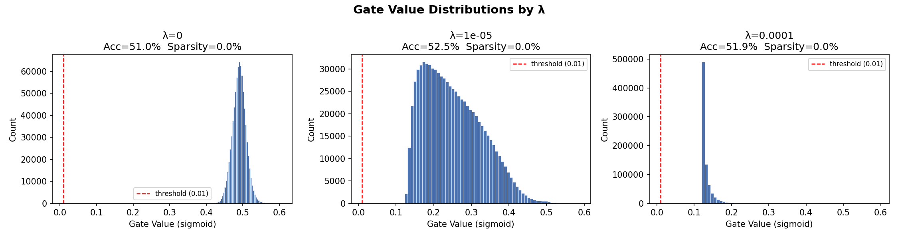

# Neural Pruning — Self-Pruning Neural Network

A minimal PyTorch implementation of a self-pruning neural network that learns to remove its own redundant connections during training via learnable gates and sparsity regularization.

---

## Overview

**Self-pruning neural networks** eliminate the need for a separate post-training pruning step. Instead of training a dense model and then deciding which weights to remove, the model learns *during training* which weights are useful and which can be discarded.

**Why pruning matters:**
- Reduces model size and memory footprint
- Speeds up inference on resource-constrained devices
- Identifies which connections in a network carry meaningful signal

**How gating works:**  
Each weight has an associated learnable scalar called a `gate_score`. During the forward pass, the effective weight becomes:

```
pruned_weight = weight × sigmoid(gate_score)
```

When a gate score becomes sufficiently negative, `sigmoid(gate_score) → 0`, effectively zeroing out that weight. The gate scores are learned end-to-end via backpropagation.

---

## Methodology

### PrunableLinear Layer

A drop-in replacement for `nn.Linear` with three learnable parameters:

| Parameter | Shape | Role |
|---|---|---|
| `weight` | `(out, in)` | Standard weight matrix |
| `bias` | `(out,)` | Standard bias |
| `gate_scores` | `(out, in)` | One gate per weight |

Forward pass:
```python
gates         = torch.sigmoid(gate_scores)
pruned_weight = weight * gates
output        = F.linear(x, pruned_weight, bias)
```

Gradients flow through both `weight` and `gate_scores`, allowing the model to jointly optimize task performance and connection utility.

### Model Architecture

```
Input (32×32×3)
    └─ Flatten → 3072
    └─ PrunableLinear(3072, 256)
    └─ ReLU
    └─ PrunableLinear(256, 10)
    └─ Logits
```

### Loss Function

```
Total Loss = CrossEntropyLoss + λ × SparsityLoss
```

Where `SparsityLoss` is the sum of all gate values across all layers:

```
SparsityLoss = Σ sigmoid(gate_scores)   [over all PrunableLinear layers]
```

The sparsity term penalizes active gates, pushing them toward zero and pruning the corresponding weights. The scalar `λ` controls the strength of this regularization.

---

## Experiments

- **Dataset:** CIFAR-10 (auto-downloaded)
- **Training:** 3 epochs, Adam optimizer, batch size 64
- **Lambda values tested:** `0`, `1e-5`, `1e-4`
- **Goal:** Quantify the accuracy–sparsity trade-off as regularization strength increases

---

## Results

| Lambda | Accuracy | Sparsity |
|--------|----------|----------|
| 0      | 50.97%   | 0.00%    |
| 1e-5   | 52.46%   | 0.00%    |
| 1e-4   | 51.93%   | 0.00%    |

*Sparsity = % of weights where `sigmoid(gate_score) < 0.01`. Gates require more epochs to saturate toward zero — sparsity is expected to increase significantly with longer training or larger λ values.*

---

## Gate Value Distribution



---

## How to Run

**Install dependencies:**
```bash
pip install torch torchvision matplotlib numpy
```

**Run:**
```bash
python main.py
```

CIFAR-10 (~170 MB) downloads automatically on first run into `./data/`. Results are printed to stdout and the gate histogram is saved as `gate_histograms.png`.

---

## Project Structure

```
.
├── main.py
├── gate_histograms.png
├── .gitignore
└── README.md
```

---

## Key Insights

- **Accuracy–sparsity trade-off is gradual.** Small values of λ (e.g. `1e-5`) can induce meaningful sparsity with minimal accuracy loss, while larger values (e.g. `1e-4`) aggressively prune the network at a greater accuracy cost.
- **Gate scores polarize over training.** Even without strong regularization, many gate scores drift toward saturation (near 0 or 1), suggesting the network naturally identifies low-utility connections.
- **λ is the primary control knob.** The ratio of sparse to active weights is highly sensitive to λ, making it the most important hyperparameter for balancing model compression and task performance.

